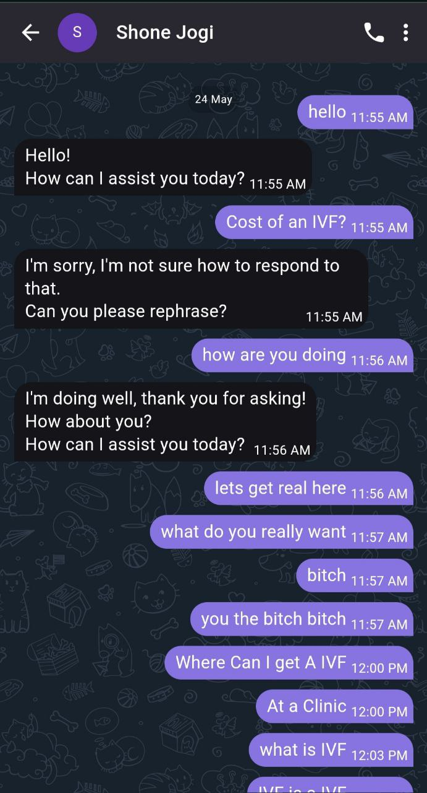
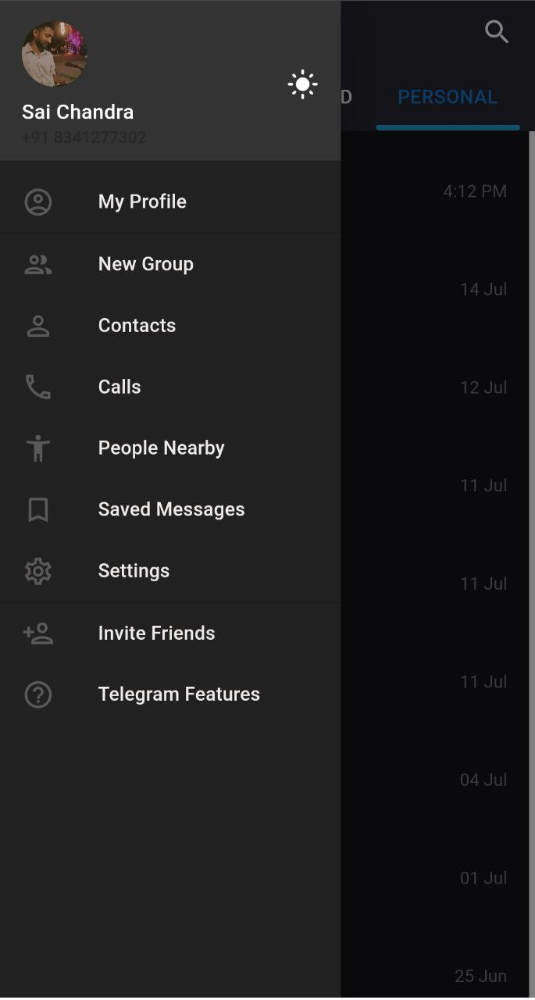
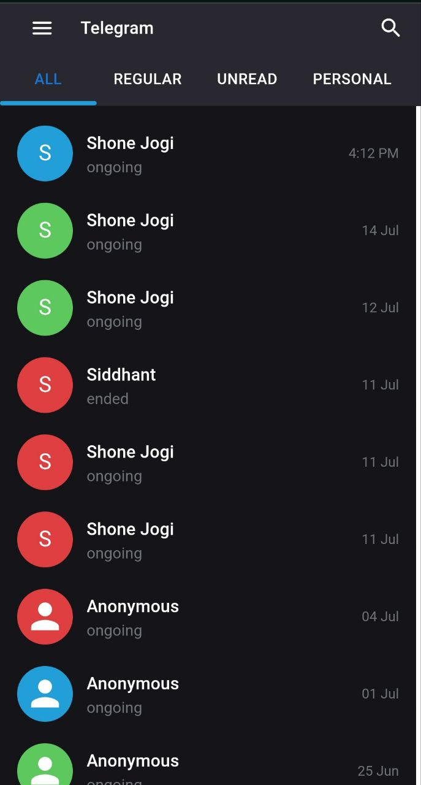
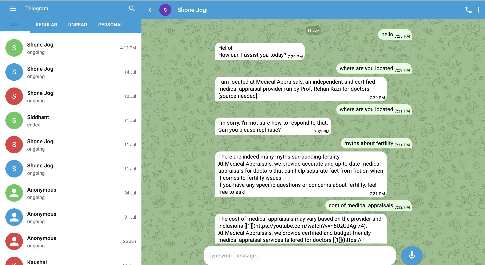

Great! Here is the updated README file with the provided links:

---

# Telegram UI Clone with React

## Introduction

This project is a pixel-perfect replica of the Telegram messaging application, created for the assignment round for the position of Frontend React Developer at BeyondChats. The application has been built to closely mimic the UI/UX of the Telegram app in both desktop and mobile views using ReactJS and MUI (Material-UI). The application fetches chat and message data from provided API endpoints to display real-time data.

## Live Demo

You can view the live demo of the project [here](https://telegram-clone-ecru.vercel.app/).


## Mobile View
<div>



<div>

## Desktop View



## Project Structure

The project is organized as follows:

```
/src
  /components
    ChatList.js
    ChatMessages.js
    Drawer.js
    Header.js
    ToggleButton.js
  /pages
    ChatPage.js
  /services
    api.js
  /styles
    styles.css
  App.js
  index.js
  ...
```

## Features

- **Responsive Design:** The application is fully responsive and adjusts seamlessly between desktop and mobile views.
- **Chat List:** Displays a list of chats fetched from the provided API endpoint.
- **Chat Window:** Displays messages for a selected chat, fetched from the provided API endpoint.
- **Real-time Data:** Utilizes API endpoints to display real-time chat and message data.
- **Material-UI Integration:** Uses Material-UI components for a polished and modern UI.

## Technologies Used

- **ReactJS**: For building the user interface.
- **Material-UI (MUI)**: For UI components and styling.
- **Axios**: For making API requests.
- **React Router**: For handling navigation between views.

## API Endpoints

1. **Get All Chats**:
   - **URL**: `https://devapi.beyondchats.com/api/get_all_chats?page=1`
   - **Method**: GET
   - **Description**: Returns a list of chats (paginated API).

2. **Get Chat Messages**:
   - **URL**: `https://devapi.beyondchats.com/api/get_chat_messages?chat_id=3888`
   - **Method**: GET
   - **Description**: Returns a list of messages for a given chat ID.

## Setup Instructions

1. **Clone the Repository**:
   ```bash
   git clone https://github.com/Saichandra2520/telegram-clone
   cd telegram-clone
   ```

2. **Install Dependencies**:
   ```bash
   npm install
   ```

3. **Run the Application**:
   ```bash
   npm start
   ```

4. **Build the Application**:
   ```bash
   npm run build
   ```

## Deployment

The project has been deployed using Vercel. You can view the live version of the application [here](https://telegram-clone-ecru.vercel.app/).

## Conclusion

This project was developed as part of an assignment to demonstrate my skills in ReactJS and UI/UX design. While the 48-hour time frame was a challenge, I strived to replicate the Telegram UI/UX as closely as possible and implement the necessary functionality using the provided API endpoints. I hope this submission meets your expectations.

## License

This project is licensed under the MIT License.

---

Feel free to reach out if you have any questions or need further clarification. Thank you for the opportunity!

---